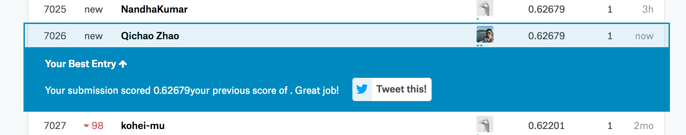

# Part 1: Initial Submission

```{r}
library(readr)
library(rpart)
# Set working directory
setwd("~/Documents/Personal/kaggle-titanic")

# Read data
train <- read_csv("~/Documents/Personal/kaggle-titanic/train.csv")
test <- read_csv("~/Documents/Personal/kaggle-titanic/test.csv")

# Generate a test dataframe that predicts everyone dies!
test$Survived <- rep(0, 418)

# Make our submission df
submit <- data.frame(PassengerId = test$PassengerId, Survived = test$Survived)
write.csv(submit, file = "submit/submit_1.csv", row.names = FALSE)
```



# Part 2: Gender-Class Model

```{r}
# Let's see a gender split
table(train$Sex)

# Now let's see gender split and survived
prop.table(table(train$Sex, train$Survived), 1)

# So, now we can try and make predictions based purely on gender
# e.g: if female, survive, if male, die
test$Survived <- rep(0, 418)
test$Survived[test$Sex == 'female'] <- 1

# Make our submission df again
submit <- data.frame(PassengerId = test$PassengerId, Survived = test$Survived)
write.csv(submit, file = "submit/submit_2.csv", row.names = FALSE)
```


```{r}
# Now lets look at age!
summary(train$Age)

# We don't really care about the absolute age, just want to find children
train$Child <- 0
train$Child[train$Age < 18] <- 1

# Now lets see survival numbers
aggregate(Survived ~ Child + Sex, data=train, FUN=sum)

# And total in each subset
aggregate(Survived ~ Child + Sex, data=train, FUN=length)

# But what we really want is survival rates per subset
aggregate(Survived ~ Child + Sex, data=train, FUN=function(x) {sum(x)/length(x)})

# The above doesn't seem to yield any new insights, so now lets look at another feature, Fare
# First lets bucket the fares
train$Fare2 <- '30+'
train$Fare2[train$Fare < 30 & train$Fare >= 20] <- '20-30'
train$Fare2[train$Fare < 20 & train$Fare >= 10] <- '10-20'
train$Fare2[train$Fare < 10] <- '<10'

# Now lets see what aggregate survival rates are by sex and fare
aggregate(Survived ~ Fare2 + Pclass + Sex, data=train, FUN=function(x) {sum(x)/length(x)})

# We notice that class 3 women who pay a lot (20+) for their tickets tend to die, so lets adjust for this in our predictions
test$Survived <- 0
test$Survived[test$Sex == 'female'] <- 1
test$Survived[test$Sex == 'female' & test$Pclass == 3 & test$Fare >= 20] <- 0

# Make our submission df again
submit <- data.frame(PassengerId = test$PassengerId, Survived = test$Survived)
write.csv(submit, file = "submit/submit_3.csv", row.names = FALSE)
```


# Part 3: Decision Trees

```{r}
library(rpart)
library(rattle)
library(rpart.plot)
library(RColorBrewer)

# Lets fit our tree
fit <- rpart(Survived ~ Pclass + Sex + Age + SibSp + Parch + Fare + Embarked,
             data=train, method="class")
fancyRpartPlot(fit)

# Submit our decision tree submission
Prediction <- predict(fit, test, type = "class")
submit <- data.frame(PassengerId = test$PassengerId, Survived = Prediction)
write.csv(submit, file = "submit/submit_4.csv", row.names = FALSE)
```


```{r}
# We can tweak the decision tree to not prune, and to keep nodes with even just two items. This leads to overfitting, so the result is worse.
fit <- rpart(Survived ~ Pclass + Sex + Age + SibSp + Parch + Fare + Embarked,
               data=train,
               method="class", 
               control=rpart.control(minsplit=2, cp=0))
fancyRpartPlot(fit)

# Submit our decision tree submission
Prediction <- predict(fit, test, type = "class")
submit <- data.frame(PassengerId = test$PassengerId, Survived = Prediction)
write.csv(submit, file = "submit/submit_5.csv", row.names = FALSE)
```


# Part 4: Feature Engineering

```{r}
# We first bind the two dataframes together
# Read the data in anew because otherwise we have column mismatches from previous sections
train <- read_csv("~/Documents/Personal/kaggle-titanic/train.csv")
test <- read_csv("~/Documents/Personal/kaggle-titanic/test.csv")

test$Survived <- NA
combi <- rbind(train, test)

# We begin with feature engineering by trying to extract titles
combi$Name <- as.character(combi$Name)
combi$Name[1]

# Do some string manipulation to extract the title
combi$Title <- sapply(combi$Name, FUN=function(x) {strsplit(x, split='[,.]')[[1]][2]})
combi$Title <- sub(' ', '', combi$Title)
table(combi$Title)

# Lets process the rarer titles to combine them
# Note I deviated slightly from the blog post here:
# 1. Madamoiselle should be the same as miss, I don't think it helps to keep a separate category when there are just 3 values in it.
# 2. Jonkheer is apparently a male title (according to the blog comments anyway...)
combi$Title[combi$Title %in% c('Mme', 'Mlle')] <- 'Miss'
combi$Title[combi$Title %in% c('Capt', 'Don', 'Major', 'Sir', 'Jonkheer')] <- 'Sir'
combi$Title[combi$Title %in% c('Dona', 'Lady', 'the Countess')] <- 'Lady'
combi$Title <- factor(combi$Title)

# Now we can engineer another feature - family size / surname combination
# Calculate the family size
combi$FamilySize <- combi$SibSp + combi$Parch + 1

# Get the surname
combi$Surname <- sapply(combi$Name, FUN=function(x) {strsplit(x, split='[,.]')[[1]][1]})

# Combine the surname and size, bucket families with < 2 members
combi$FamilyID <- paste(as.character(combi$FamilySize), combi$Surname, sep="")
combi$FamilyID[combi$FamilySize <= 2] <- 'Small'

table(combi$FamilyID)

# Bucket the families with < 2 as small (catching any we missed in the previous step)
famIDs <- data.frame(table(combi$FamilyID))

combi$FamilyID[combi$FamilyID %in% famIDs$Var1] <- 'Small'
combi$FamilyID <- factor(combi$FamilyID)

# Break back out into train and test
train <- combi[1:891,]
test <- combi[892:1309,]

# fit:
fit <- rpart(Survived ~ Pclass + Sex + Age + SibSp + Parch + Fare + Embarked + Title + FamilySize + FamilyID,
               data=train, 
               method="class")

# Submit
Prediction <- predict(fit, test, type = "class")
submit <- data.frame(PassengerId = test$PassengerId, Survived = Prediction)
write.csv(submit, file = "submit/submit_6.csv", row.names = FALSE)
```


```{r}
# I was curious to see if engineering family surnames or size actually helped, so I tested a 7th submission without engineering family surnames and size

# fit:
fit <- rpart(Survived ~ Pclass + Sex + Age + SibSp + Parch + Fare + Embarked + Title, data=train, method="class")

# Submit
Prediction <- predict(fit, test, type = "class")
submit <- data.frame(PassengerId = test$PassengerId, Survived = Prediction)
write.csv(submit, file = "submit/submit_7.csv", row.names = FALSE)

# It turns out by removing surnames and size we get an improved accuracy, indicating we are probably over-engineering our features with these.
```


# Part 5: Random Forests

```{r}
# Lets fill in missing data first using a decision tree to predict age based off known ages
Agefit <- rpart(Age ~ Pclass + Sex + SibSp + Parch + Fare + Embarked + Title + FamilySize, data=combi[!is.na(combi$Age),], method="anova")
combi$Age[is.na(combi$Age)] <- predict(Agefit, combi[is.na(combi$Age),])

summary(combi)

# Check if we have missing data
summary(as.factor(combi$Embarked))
which(is.na(combi$Embarked))
which(is.na(combi$Fare))

# Seems like we just have missing data on the Embarked and Fare, fill that ones in.
combi$Embarked[c(62,830)] = "S"
combi$Embarked <- factor(combi$Embarked)
combi$Fare[1044] <- median(combi$Fare, na.rm=TRUE)

# We also need to make sure our other dep variables are all factors
combi$Sex = factor(combi$Sex)

# Adjust the FamilyID to reduce the number of factors
combi$FamilyID2 <- combi$FamilyID
combi$FamilyID2 <- as.character(combi$FamilyID2)
combi$FamilyID2[combi$FamilySize <= 3] <- 'Small'
combi$FamilyID2 <- factor(combi$FamilyID2)

# Break back out into train and test
train <- combi[1:891,]
test <- combi[892:1309,]

# Now lets make a random forest!
library(randomForest)
set.seed(415)

fit <- randomForest(as.factor(Survived) ~ Pclass + Sex + Age + SibSp + Parch + Fare +
Embarked + Title + FamilySize + FamilyID2, data=train, importance=TRUE, ntree=2000)

varImpPlot(fit)

# Make pred
Prediction <- predict(fit, test)
submit <- data.frame(PassengerId = test$PassengerId, Survived = Prediction)
write.csv(submit, file = "submit/submit_8.csv", row.names = FALSE)
```

The importance plots differ a little from the blog post (on Accuracy), probably because we grouped Titles up slightly differently.


```{r}
# Now lets try with conditional inference RF
library(party)

set.seed(415)
fit <- cforest(as.factor(Survived) ~ Pclass + Sex + Age + SibSp + Parch + Fare +
Embarked + Title + FamilySize + FamilyID, data = train, controls=cforest_unbiased(ntree=2000, mtry=3))

Prediction <- predict(fit, test, OOB=TRUE, type = "response")
submit <- data.frame(PassengerId = test$PassengerId, Survived = Prediction)
write.csv(submit, file = "submit/submit_9.csv", row.names = FALSE)
```

This again matched the best score from my feature engineered decision tree, but did not improve on it.

